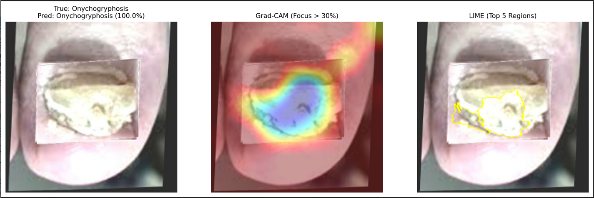
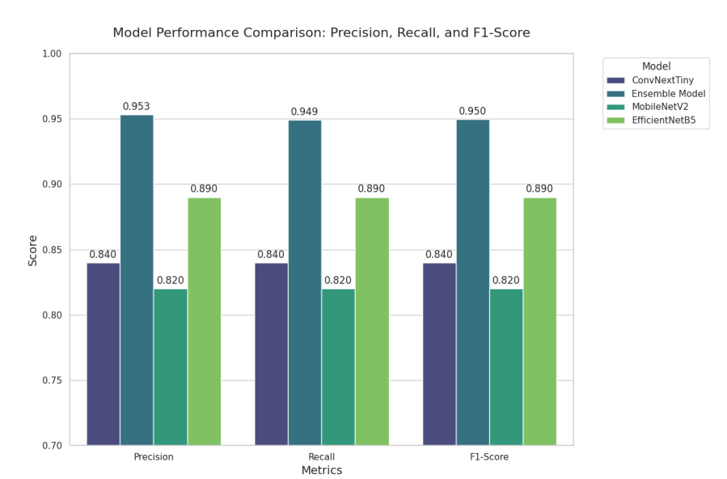
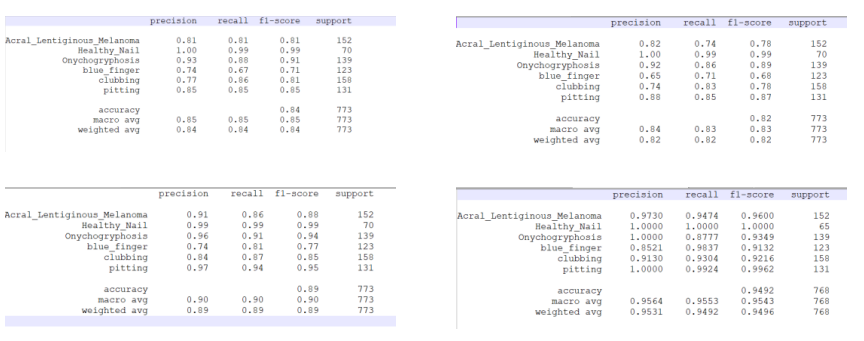
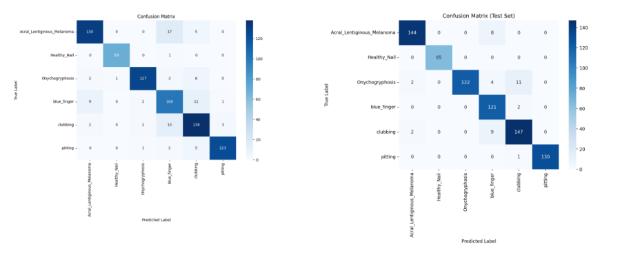
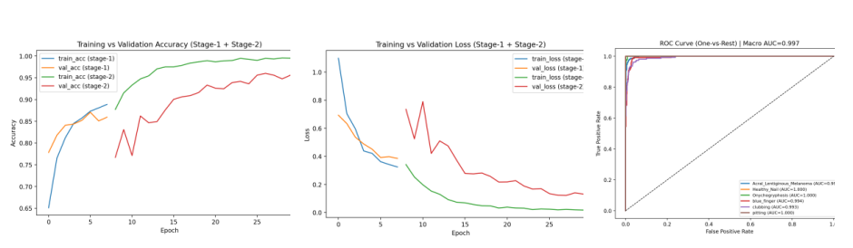

# 🧠 Nail Disease Detection via Hybrid Deep Learning & Ensemble Architecture

An explainable medical AI system designed to classify nail diseases from clinical images using a **Hybrid Deep Learning + Classical ML Ensemble architecture**.

Instead of relying on a single neural network, the system separates **visual perception** from **decision reasoning**, creating a two-stage diagnostic pipeline.

---

# 📌 Project Overview

Medical image classification is challenging due to high dimensional image data and limited labeled medical datasets.

This project introduces a **hybrid AI architecture**:

1️⃣ Deep learning extracts visual patterns from nail images
2️⃣ Classical machine learning performs robust final classification

This combination improves performance while maintaining interpretability.

---

# 🔬 Target Disease Classification

The system detects the following nail conditions:

• Acral Lentiginous Melanoma (ALM)
• Onychogryphosis
• Nail Clubbing
• Nail Pitting
• Blue Finger Syndrome
• Healthy Nails

---

# 🧠 Hybrid Architecture

The pipeline consists of two independent engines.

### Phase 1 — Vision Engine (Deep Feature Extraction)

Transfer learning using **MobileNetV2 (ImageNet pretrained)** converts nail images into **1280-dimensional feature embeddings**.

These embeddings capture:

* nail texture
* pigmentation patterns
* curvature structures
* abnormal growth patterns

Instead of classifying directly, the CNN acts as a **feature extractor**.

---

### Phase 2 — Logic Engine (Triple Ensemble)

The extracted features are passed to three classical ML models:

• Support Vector Classifier (RBF kernel)
• Random Forest
• Logistic Regression

Final prediction is computed using **Soft Voting Ensemble**:

Final Prediction = argmax(sum(predicted probabilities))

This improves decision stability for borderline medical cases.

---

# 🔎 Explainable AI (Grad-CAM & LIME)

Medical AI must be interpretable. Two explainability techniques were used.

### Grad-CAM

Highlights which image regions influenced the CNN.

### LIME

Identifies important regions contributing to the final classification.

The model correctly focuses on **clinically relevant nail regions** rather than background noise.

---

# 📊 Model Performance Comparison

The hybrid architecture significantly outperformed standalone CNN models.

| Model               | Precision | Recall   | F1 Score |
| ------------------- | --------- | -------- | -------- |
| ConvNeXtTiny        | 0.84      | 0.84     | 0.84     |
| MobileNetV2         | 0.82      | 0.82     | 0.82     |
| EfficientNetB5      | 0.89      | 0.89     | 0.89     |
| **Hybrid Ensemble** | **0.95**  | **0.95** | **0.95** |

---

# 📑 Classification Reports

Detailed classification reports were generated to evaluate model performance per disease class.

Metrics evaluated:

• Precision
• Recall
• F1 Score
• Support

---

# 🔢 Confusion Matrix Analysis

Confusion matrices reveal misclassification patterns between similar nail diseases.

The hybrid ensemble reduces confusion between visually similar classes.

---

# 📈 Training Dynamics

Training and validation curves show stable convergence and minimal overfitting.

The ROC curve demonstrates excellent separation between disease categories.

Macro AUC ≈ **0.997**

---

# 🚀 Engineering Insights

Key technical outcomes from this project:

• Hybrid deep learning + classical ML improves medical image classification
• CNN embeddings solve the classical **image flattening problem**
• Ensemble classifiers improve decision robustness
• Dimensionality compression speeds up training significantly

---

# ⚠️ Source Code Availability

Full source code, dataset pipelines, and trained model weights are currently **withheld due to pending academic publication**.

This repository serves as a **technical showcase of system architecture and experimental results**.

Code access may be shared during interviews or released post-publication.

---

# 🧪 Potential Applications

• AI-assisted dermatology diagnostics
• Telemedicine screening tools
• Clinical decision support systems
• Automated medical triage

---

# 👨‍💻 Author

**MD. ISTIAK AHAMED**
Computer Science & Engineering

Research Focus:
Medical AI • Machine Learning • Intelligent Systems
